# qed 架构文档

> Cross-platform desktop skeleton — Perry TypeScript AOT → 原生 `.exe` / `.app` / `.AppImage`

本文档基于当前代码库（`src/` 共 92 文件，约 38k 行）梳理模块划分、依赖方向、运行时数据流与关键约束。所有图表使用 Mermaid 渲染。

---

## 1. 全局概览

qed 是一个**单进程、单线程**的跨平台桌面应用骨架。它没有使用 Electron / Tauri / Qt，而是把 TypeScript 直接编译为**原生二进制**（macOS / Windows / Linux）。同一份 `src/` 在不同主机上产出不同的发布物（`.dmg` / `.msi` / `.AppImage`）。

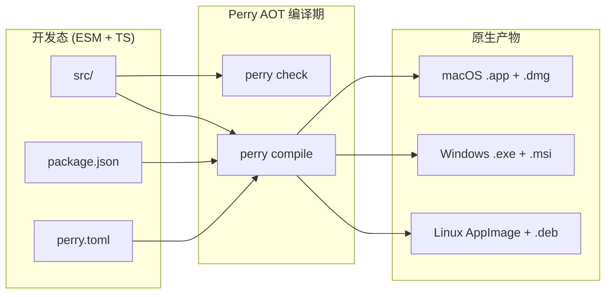

### 核心特征

| 维度 | 决策 |
|---|---|
| 编译模型 | TypeScript → AOT → 原生二进制（无 Node 运行时） |
| UI 框架 | `perry/ui`（无 React / Vue / Redux） |
| 状态管理 | `perry/ui` `State<T>` 反应式单元 + 自建 `AppStore`（pub-sub） |
| 模块通信 | 类型化进程内 `IpcBus`（单线程微任务） |
| OS 抽象 | 集中于 `src/platform/`，AOT 编译期消除死分支 |
| 配置 | JSON + 防抖刷新，存于 `appDataDir/config.json` |

---

## 2. 顶层架构

qed 在运行时只有一条「启动 → 装配 → 渲染 → 事件循环」的主线。`src/main.ts` 是唯一入口，按严格顺序串起 5 个装配阶段。

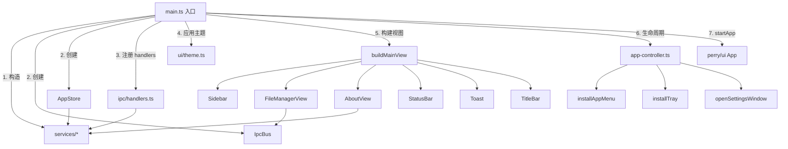

### 启动顺序（`main.ts` 第 51-79 行）

1. **Services**：`ConfigService` / `FileService` / `RecentFilesService` / `NotificationService` / `ShellService` 全部构造。
2. **IPC + Store**：`IpcBus` 实例化，`AppStore` 注入 `ConfigService` + `RecentFilesService`。
3. **Handlers**：`registerIpcHandlers(bus, ctx)` 把所有 channel 路由到 service。
4. **Theme**：`applyTheme(store.getState().resolvedTheme)` 提前刷调色板，避免首帧闪烁。
5. **View**：`buildMainView` 组装主窗口的 widget 树。
6. **Lifecycle**：`onActivate` / `onTerminate` 钩子挂上。
7. **Start**：`startApp(ctx, mainView)` 安装菜单 / 托盘，开启 Perry 事件循环。

---

## 3. 模块划分

`src/` 按「职责纵向切片」组织，每个目录只承担一种关注点。模块之间**单向依赖**（controller → services → modules → ipc），禁止反向引用。

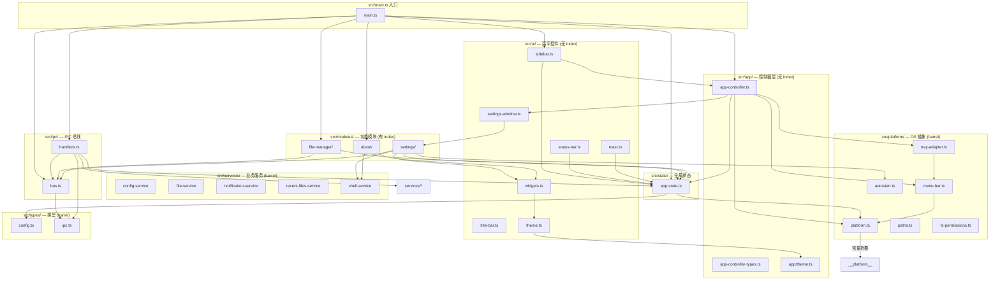

### 3.1 依赖方向约束

| 层 | 允许依赖 | 禁止依赖 |
|---|---|---|
| `main.ts` | 全部 | — |
| `app/` | `ipc/`、`services/`、`state/`、`types/`、`platform/`、`ui/` | `modules/`（避免反向耦合） |
| `modules/*` | `ipc/`、`state/`、`types/`、`ui/widgets.ts`、`platform/`（少数 helpers）、`services/*`（settings 显式 import） | `app/app-controller.ts`（除 settings 显式） |
| `ipc/` | `types/`、`platform/explainFsError` | `modules/`、`ui/` |
| `services/` | `platform/`、`types/`、自己的 `fs` 调用 | `ipc/`、`modules/` |
| `platform/` | Node OS / `perry/ui` 原生 API | 业务 |
| `ui/` | `perry/ui`、`app/theme.ts`（仅 token）、`state/`（订阅） | `services/`、`ipc/` |
| `state/` | `types/`、`platform/`、`services/*`（订阅） | `ipc/`、`ui/` |

---

## 4. 模块详述

### 4.1 `src/main.ts` — 应用入口

**作用**：唯一的启动文件。负责按顺序装配 services、IPC bus、store、handlers、theme、main view、lifecycle hook，再调用 `startApp()` 启动 Perry 事件循环。

**关键职责**

- 构建 `ControllerContext`（7 个服务 / 总线 / store 的服务袋），**全局唯一**。
- 订阅 `AppStore` 的 `route` 字段并镜像到本地 `State<Route>`，让 Perry runtime 可以在路由切换时 diff 子树。
- 预构建 `FileManagerView`（开销较大），其他视图通过 `pickRoute(route, …)` 懒选择。
- 不持有任何业务状态，所有可变状态都委托给 `AppController` / `AppStore`。

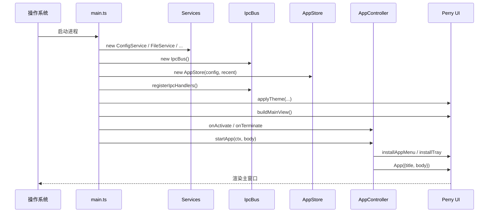

---

### 4.2 `src/app/` — 控制器层

**作用**：应用的「大脑」。所有跨切面动作（菜单、托盘、键盘快捷键、按钮、IPC 事件）都汇总到 `AppController.handleCommand()` 这一个分发函数。

**核心导出**

| 名称 | 作用 |
|---|---|
| `startApp(ctx, body)` | 装配主窗口、菜单、托盘，启动运行循环（仅调用一次） |
| `handleCommand(command)` | 19 个 `AppCommand` 的穷尽 switch；编译期强制处理新命令 |
| `navigateTo(route)` | 切换侧边栏路由，发布 `route-changed` 事件 |
| `openSettingsWindow()` / `closeSettingsWindow()` | 显示 / 隐藏次级「设置」窗口（always-on-top） |
| `onAppEvent(listener)` | 订阅控制器事件，返回反订阅 |
| `onAppActivate/Terminate/Background/Foreground()` | 生命周期钩子 |
| `describeEnvironment()` | 返回 host / appDataDir / cacheDir / logDir 快照 |
| `cycleTheme()` | system → light → dark → system 循环 |
| `toggleAlwaysOnTop()` | 切换常驻顶层标志（Perry 当前未暴露 OS 级 API） |

**事件总线（`AppEvent`）**

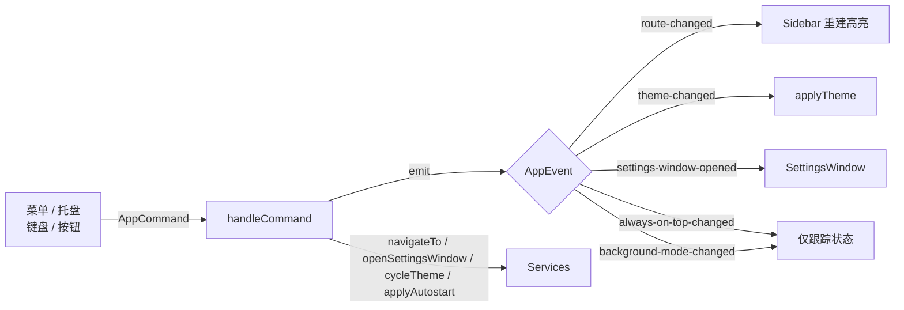

**约定**

- **没有 `index.ts`**：`startApp` 等具体符号直接 import，避免桶装掩盖归属。
- **`ControllerContext` 只构造一次**：在 `main.ts`；其它地方仅透传。
- **穷尽检查**：`handleCommand` 末尾用 `const _exhaustive: never = command` 强约束，添加新命令必须在此处理。
- **调色板是冻结的**：`LIGHT` / `DARK` 来自 `app/theme.ts`，通过 `Object.freeze` 保护。

---

### 4.3 `src/ipc/` — IPC 总线

**作用**：UI ↔ Service 之间的唯一通道。`IpcBus` 是带类型的「进程内命令分发器」，不是跨进程 IPC——qed 在 AOT 后是单进程单线程。

**两个文件**

- **`bus.ts`** — 通用 `IpcBus` 类。
  - `register(channel, handler)` 注册处理器，最后写入胜出。
  - `send<TIn, TOut>(channel, payload)` 调处理器，**绝不抛异常**到 UI（错误走 `IpcErr.message`）。
  - `call<TIn, TOut>(channel, payload)` 直接返回 `IpcResponse` 信封。
  - 每个请求分配一个 `IpcId`（时间戳 + 计数器），便于将来切换到 worker 模式。
- **`handlers.ts`** — 全部 channel 的具体路由。每个 handler 是 `try { … } catch` 的唯一合法位置。
  - 当前 16 个 channel：`config:get/update`、`fs:list/read/write/delete/rename/mkdir/stat`、`shell:open-path/url`、`notify:send`、`platform:info`、`recent:add/list/clear`。
  - 处理器内部只委托 service，不直接读 `fs` / `perry/system`。

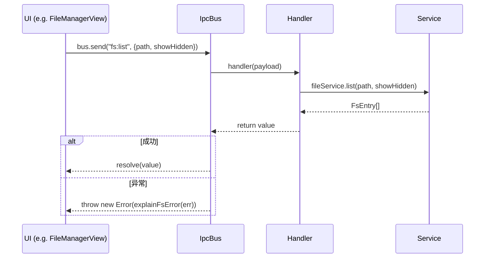

**约束**

- UI 层**不直接 import `fs`**，所有 FS 走 `IpcBus → FileService`。
- 处理器内的 `try/catch` 是项目中唯一允许的地方（其它地方一律透传）。

---

### 4.4 `src/services/` — 业务服务层

**作用**：跨切面业务能力的封装层。这是 `src/` 内**唯一**直接 import `fs` 或 `perry/system` 的目录。

| 服务 | 文件 | 关键能力 |
|---|---|---|
| `ConfigService` | `config-service.ts` | 加载 / 保存 `appDataDir/config.json`；schema 版本迁移；**250ms 防抖刷新**；支持订阅 |
| `FileService` | `file-service.ts` | 同步 FS 操作：`list` / `read` / `write` / `delete` / `rename` / `mkdir` / `stat`；读 ≤32MB，列目录 ≤5000 项；`assertSafePath` 拦截 NUL 字节与空路径 |
| `NotificationService` | `notification-service.ts` | `send(title, body)`；**自动检查 `config.notifications` 偏好**，未开启时静默 no-op |
| `RecentFilesService` | `recent-files-service.ts` | `appDataDir/recent-files.json` 持久化；最多 20 项，去重并按 LRU 排序；每次修改立即落盘 |
| `ShellService` | `shell-service.ts` | `openURL`（`perry/system`）；`revealInFileManager`（macOS `open -R` / Windows `explorer /select,` / Linux `xdg-open`） |

**约定**

- 通过桶 `import { ConfigService } from '../services/index.js'` 引入，**禁止**深链单文件（除本目录内部）。
- 服务之间通过构造函数注入依赖（`NotificationService(config)`），避免副作用 import。
- `assertSafePath` 是 FS 写入的强制入口，新增 FS 调用必须复用。

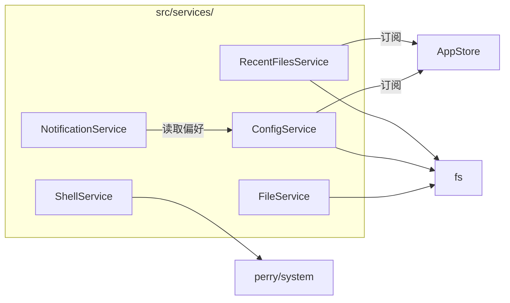

---

### 4.5 `src/modules/` — 功能模块

每个模块是一个**自包含的纵向切片**：UI 视图 + 业务操作 + 桶装 `index.ts`。模块之间互不依赖（除 settings 显式 import 控制器诊断函数）。

#### 4.5.1 `file-manager/`

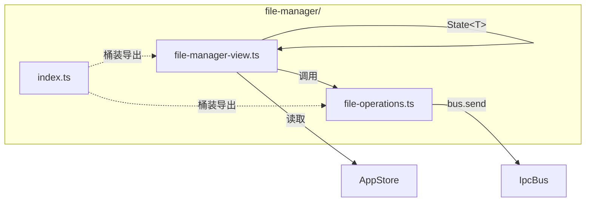

- **布局**：`PathBar`（↑ / 🏠 / 路径 / Go）→ `Toolbar`（Refresh / New Folder / New File / Delete / Reveal / Show Hidden）→ `Listing` → `Preview` → `Error`。
- **状态**：6 个 `State<T>` 单元（`currentPath` / `entries` / `showHidden` / `previewText` / `previewPath` / `error`），全部 local to view function。
- **`file-operations.ts`**：纯 IPC 包装器。10 个函数（`refresh` / `enterDirectory` / `stat` / `createFolder` / `createFile` / `rename` / `deleteEntry` / `readText` / `revealInFinder` / `pushRecent`），均无 `fs` 引用。

#### 4.5.2 `settings/`

- 真实可用的偏好表单，**无 TODO / 无占位符**。
- 4 个分区：Appearance（Theme / FontSize / DisplayName）/ Behaviour（Autostart / Notifications / Background mode）/ Storage（3 个 Reveal 按钮）/ About（版本 + 主机）。
- 每次控件变更都通过 `bus.send('config:update', {patch})` 写回，由 `ConfigService` 防抖落盘。
- 切换 autostart 时同步调用 `enableAutostart()` / `disableAutostart()` 写系统清单。

#### 4.5.3 `about/`

- 只读视图：应用名、版本、副标题、Credits、系统信息（Platform / Arch / ExecPath / AppData）、操作按钮（打开日志 / 打开文档）。
- 通过 `describeEnvironment()` 拿到路径快照，调用 `ShellService.revealInFileManager`。
- 同时被 `main.ts` 在「Settings 路由」时复用（避免在主窗口内重复放置设置表单）。

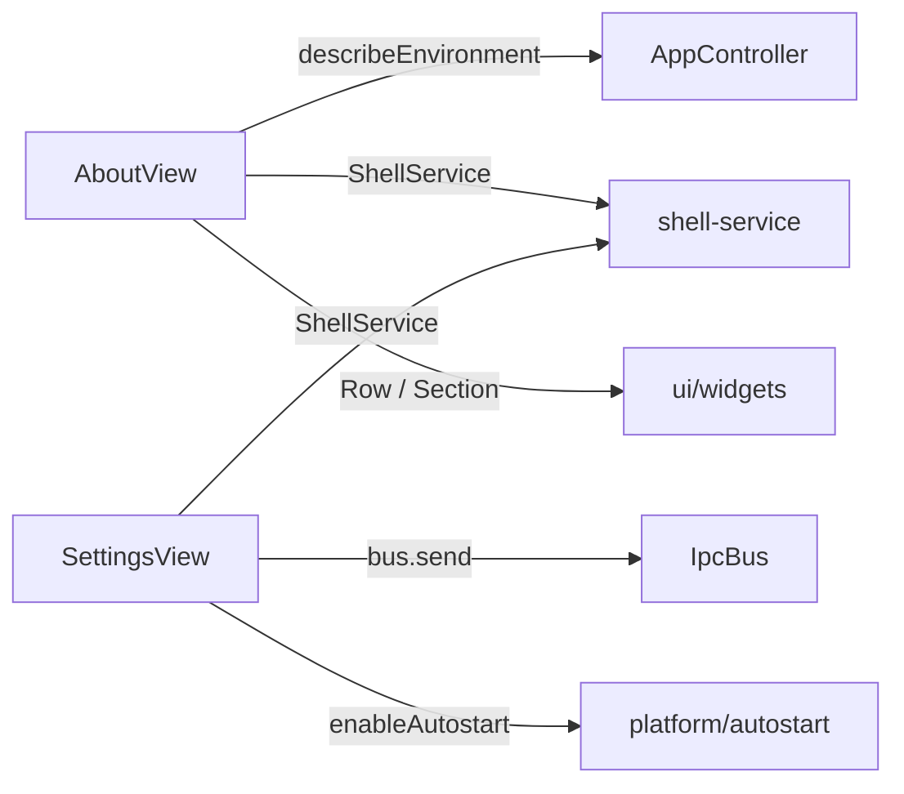

---

### 4.6 `src/platform/` — 操作系统抽象

**作用**：把一切 OS 差异（路径、权限、托盘、菜单、autostart）收口到 6 个模块，**编译期通过 `__platform__` 常量折叠消除死分支**。

| 文件 | 关键导出 | 作用 |
|---|---|---|
| `platform.ts` | `HostKind` / `isMacOS/Windows/Linux` / `platformLabel` | 主机识别（基于 `__platform__` 常量） |
| `paths.ts` | `appDataDir` / `cacheDir` / `logDir` / `configFilePath` / `recentFilesPath` / `autostartManifestPath` | 跨平台路径解析（macOS `%APPDATA%` / Linux XDG / Windows Roaming） |
| `fs-permissions.ts` | `checkFsAccess` / `explainFsError` | 权限探测 + 错误码 → 友好文案 |
| `autostart.ts` | `enableAutostart` / `disableAutostart` / `isAutostartEnabled` | 写 macOS LaunchAgent plist / Windows .cmd / Linux .desktop |
| `menu-bar.ts` | `AppCommand` 联合（19 个）/ `installAppMenu` | 应用菜单（macOS App / File / Edit / View / Help） |
| `tray-adapter.ts` | `installTray` / `TrayHandle` | 托盘图标 + 上下文菜单（统一左键 / 右键语义） |
| `index.ts` | — | 桶装：所有调用方 `import { … } from '../platform/index.js'` |

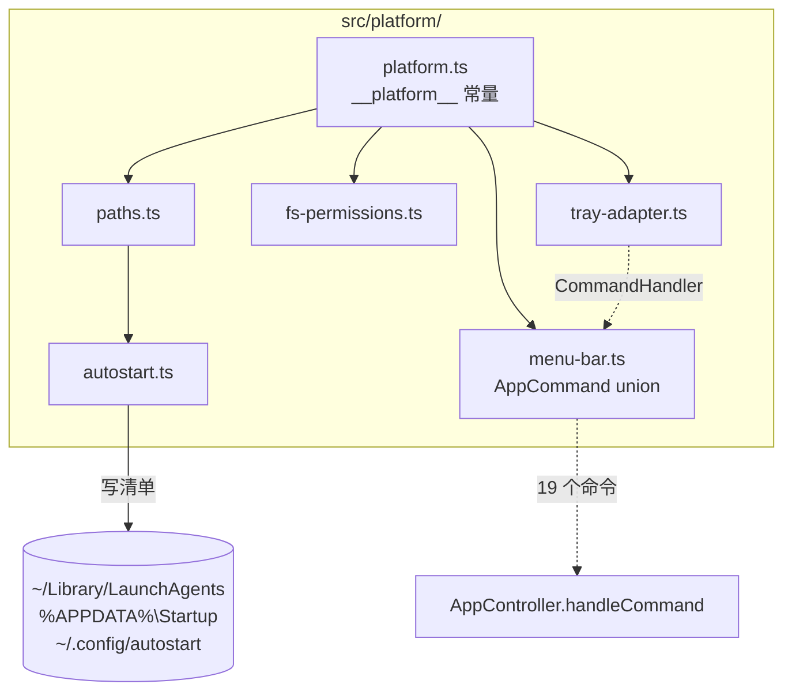

**约束**

- `src/app/` / `modules/` / `ui/` / `ipc/` **禁止** import `fs`；所有 FS 必须经此目录的 helpers 或经 `services/`。
- `AppCommand` 是**单一命令源**：菜单 / 托盘 / 快捷键 / 按钮都映射到该联合；新增命令需三处同步：联合 + 菜单 + controller。
- `__platform__` 是 Perry 编译期常量，运行时 `if (PLATFORM === macOS)` 的另一分支会被 AOT 编译器消除。

---

### 4.7 `src/state/` — 全局状态

**作用**：进程内**唯一**的可观察应用状态容器。模块级别不允许创建独立 store。

**`AppStore` 接口**

```ts
interface AppState {
  route: 'file-manager' | 'settings' | 'about';
  config: AppConfig;          // 镜像自 ConfigService
  resolvedTheme: 'light' | 'dark';
  recentFiles: readonly string[];
  lastError: string | null;   // 瞬时错误（toast 拉取）
  isBusy: boolean;
}
```

**关键能力**

- 构造时**双向订阅** `ConfigService`（`configUnsub`）和 `RecentFilesService`（按需 `notifyRecentChanged`）。
- 6 个 setter（`setRoute` / `setError` / `clearError` / `setBusy` / `refreshTheme` / `dispose`）+ `subscribe(listener)`。
- `resolveTheme(theme)`：纯函数。`system` 时调用 `perry/system.isDarkMode()`。

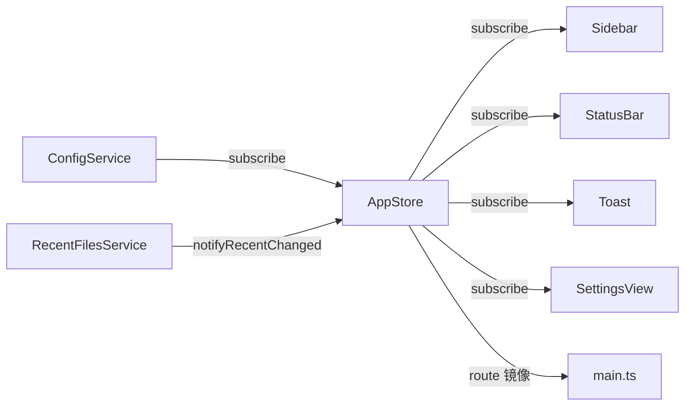

---

### 4.8 `src/ui/` — 扁平控件层

**作用**：7 个文件，**没有 `index.ts`**。`perry/ui` 是底层 widget API，本目录把它打包成业务级控件。

| 文件 | 内容 | 关键 API |
|---|---|---|
| `theme.ts` | 调色板 + 涂色 helpers | `applyTheme` / `getPalette` / `paintBackground` / `paintText` / `paintMuted` / `paintAccent` / `paintDanger` / `paintSuccess` |
| `sidebar.ts` | 侧边栏导航 | `Sidebar(initial)` → `{ root, bind }`；订阅 `route-changed` 与 `recentFiles` |
| `status-bar.ts` | 底部状态栏 | `StatusBar(store)`；显示 `lastError` + busy 圆点 |
| `title-bar.ts` | 无边框自定义标题栏 | `TitleBar(moduleTitle)` |
| `settings-window.ts` | 设置窗口工厂 | `createSettingsWindow(bus, store)` → `PerryWindow`；控制器持有 handle 复用 |
| `toast.ts` | 4s 顶部错误条 | `Toast(store)`；监听 `lastError` 变化 |
| `widgets.ts` | 复合控件原语 | `Section` / `Row` / `Badge` / `ButtonRow` / `withDefaultTextColor` |

**主窗口 widget 树**（`main.ts` 第 137-142 行）

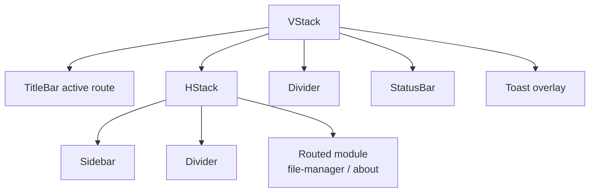

**约束**

- **禁止** `index.ts`：选择性 import 保持边界清晰。
- `State<T>` 必须**局部**于 view 函数；只有 `StatusBar` / `Toast` 通过参数接收 `AppStore`。
- 涂色只走 `theme.ts` 的 `paint*` helpers；禁止直接传 RGBA。

---

### 4.9 `src/types/` — 类型契约

**作用**：纯类型定义，**零运行时**。两个文件通过 `index.ts` 桶装导出。

- **`config.ts`** — `AppConfig` 接口 + `DEFAULT_CONFIG` 常量 + `ThemeMode` 别名。Schema 版本号固化在 `version: 1`。
- **`ipc.ts`** — IPC 信封类型（`IpcRequest` / `IpcOk` / `IpcErr` / `IpcResponse` / `IpcId` / `IpcChannel`）和 14 个 channel 的 payload 形状（`FsListPayload` / `FsReadPayload` / …）。

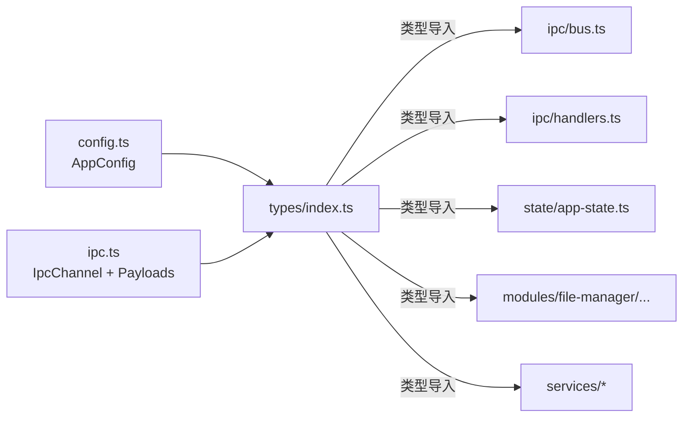

---

## 5. 核心数据流

### 5.1 启动 → 渲染

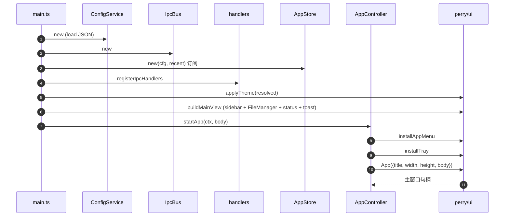

### 5.2 用户点菜单 → 命令分发

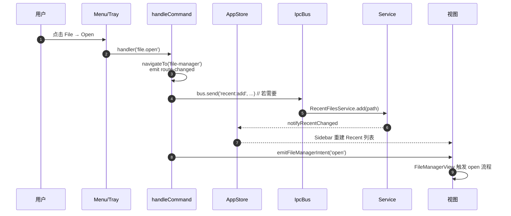

### 5.3 主题切换

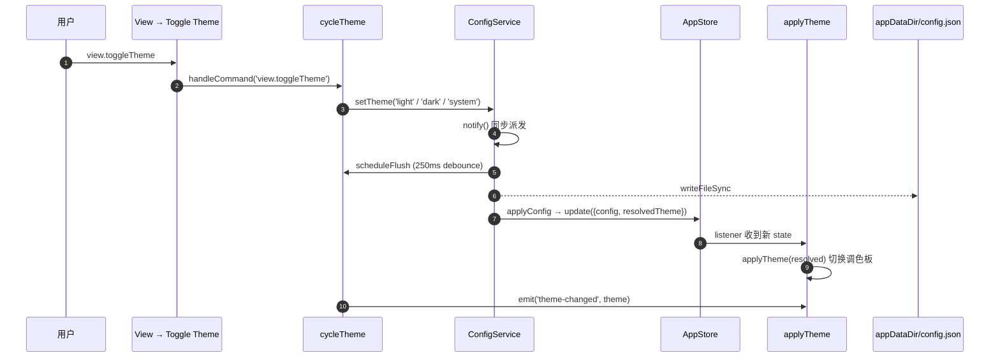

### 5.4 文件操作（FS 经 IPC）

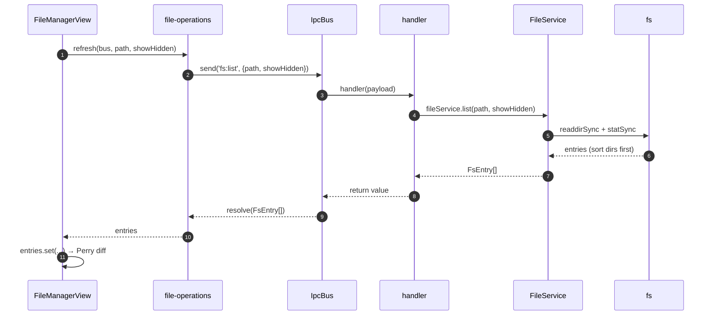

---

## 6. 关键约束与反模式（开发时务必遵守）

| 类别 | 规则 | 出处 |
|---|---|---|
| 编译 | 禁止 `eval` / `new Function` / 动态 `require` / N-API | Perry AOT |
| 编译 | 禁止在编译期访问 `process`；`process.env` 必须条件于运行时 | AOT |
| 模块边界 | `services/*` 是**唯一**直接 import `fs` / `perry/system` 的目录 | `services/AGENTS.md` |
| 模块边界 | `modules/*` 禁止直接 import `fs`，必须经 `IpcBus` | `modules/file-manager/AGENTS.md` |
| 控制器 | `ControllerContext` 全局唯一，仅在 `main.ts` 构造 | `app/AGENTS.md` |
| 控制器 | `AppCommand` 必须穷尽处理；TypeScript 编译期强制 | `app/AGENTS.md` |
| IPC | 处理器内**唯一允许**的 `try/catch` 位置 | `ipc/handlers.ts` |
| IPC | bus 永不抛异常到 UI；错误走 `IpcErr.message` | `plan_ui_v1.md:515` |
| 通知 | 必须经 `NotificationService.send`；该方法自带偏好 gate | `services/AGENTS.md` |
| 写入 | `appDataDir` / `cacheDir` / `logDir` 之外写入前必须 `checkFsAccess` | `platform/AGENTS.md` |
| 状态 | 禁止在 `AppStore` 之外创建独立 store | `app/AGENTS.md` |
| 状态 | 禁止在 `src/services/` / `src/ui/` 之外创建模块级可变单例 | `AGENTS.md` |
| UI | `src/ui/` 禁止 `index.ts` | `ui/AGENTS.md` |
| 状态单元 | UI 状态用 `perry/ui` `State<T>`，不用 Redux/MobX/React | `ui/AGENTS.md` |
| 调色板 | 涂色只走 `ui/theme.ts` 的 `paint*` helpers | `ui/AGENTS.md` |
| 注释 | 禁止 TODO / FIXME / HACK / placeholder | `settings-view.ts` |
| 版本 | `AppConfig.version` 不允许被 patch 覆盖 | `config-service.ts` |
| 同步 | 同步 IPC 不允许；所有 `bus.send` 返回 `Promise<T>` | `AGENTS.md` |
| 错误 | 禁止静默吞错；必须 log（`console.error` 配 `eslint-disable`） | `plan_ui_v1.md` |

---

## 7. 构建与发布

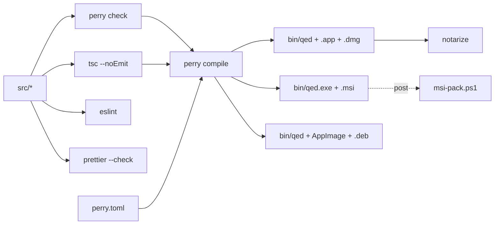

| 目标 | 命令 | 产物 |
|---|---|---|
| 开发（mac/linux） | `npm run dev` | `perry dev` live-reload |
| 静态检查 | `npm run check` / `typecheck` / `lint` | Perry / tsc / eslint |
| 格式 | `npm run format:check` | prettier |
| 本地构建 | `npm run build` | `bin/qed`（当前平台） |
| macOS 发布 | `npm run build:mac` → `package:mac` | `.app` + `.dmg`（notarized） |
| Windows 发布 | `npm run build:windows` → `package:windows` | `.exe`（LLVM toolchain）→ `.msi`（post-script） |
| Linux 发布 | `npm run build:linux` → `package:linux` | AppImage + `.deb` |

CI 仅跑 `format:check`（`.github/workflows/build.yml`），**没有单元测试**——若需添加，应选用项目内未使用的框架。

---

## 8. 运行时拓扑总览

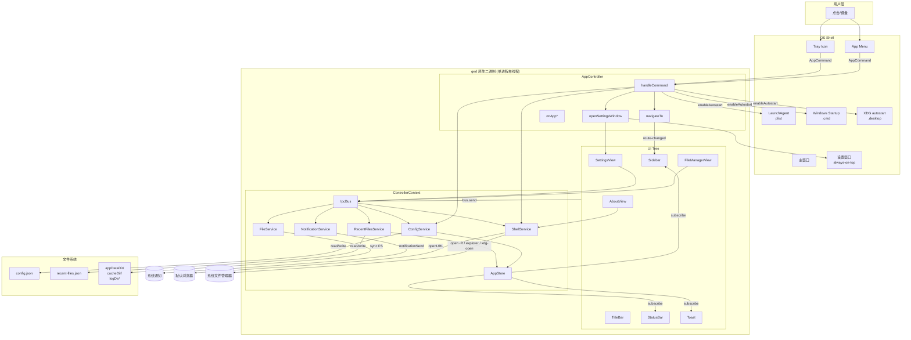

---

## 9. 文件清单速查

```
qed/
├── src/main.ts                          入口；装配 services / bus / store / view / lifecycle
├── src/app/
│   ├── app-controller.ts                startApp, handleCommand, navigateTo, openSettingsWindow
│   ├── app-controller-types.ts          ControllerContext, AppEvent, AppCommand 重导出
│   └── theme.ts                         LIGHT/DARK Palette, paletteFor(), RGBA 类型
├── src/ipc/
│   ├── bus.ts                           IpcBus 类：send/call，类型化、不可抛
│   └── handlers.ts                      16 个 channel 的具体路由
├── src/services/                        桶装：ConfigService / FileService / NotificationService / RecentFilesService / ShellService
├── src/modules/
│   ├── file-manager/                    index.ts + file-manager-view.ts + file-operations.ts
│   ├── settings/                        index.ts + settings-view.ts + settings-changes.ts
│   └── about/                           index.ts + about-view.ts
├── src/state/app-state.ts               AppStore + resolveTheme + describePlatform
├── src/types/                           桶装：config.ts + ipc.ts
├── src/platform/                        桶装：platform / paths / fs-permissions / autostart / menu-bar / tray-adapter
├── src/ui/                              扁平：theme / sidebar / status-bar / title-bar / settings-window / toast / widgets
├── platforms/shared/icon.png            跨平台图标资源
├── scripts/                             build-*.sh / package-*.sh / msi-pack.ps1
├── docs/plan_ui_v1.md                   UI 设计规范（52KB 单一文档）
├── .agents/skills/perry-dev/            Perry AOT 参考资料（29 文档，**只读**）
├── perry.toml                           AOT 编译配置（mac/win/linux 段）
├── package.json                         npm scripts + perry CLI
├── tsconfig.json                        ESM, strict, bundler, isolatedModules
├── .eslintrc.json / .prettierrc.json    编码风格
└── .github/workflows/build.yml          CI：ubuntu/mac/windows matrix
```

---

## 10. 一句话总结

> **qed 是一台「单进程反应式状态机」**：用户输入经菜单 / 托盘 / IPC 收口到 `AppController.handleCommand` 一处分发；状态变化通过 `AppStore` 推送给所有订阅者；视图层只用 `perry/ui` `State<T>` 做局部反应式 UI；任何 FS / 系统调用都必须经过 `services/` 或 `platform/` 的薄包装——这就是它在 92 个文件里仍然保持清晰的原因。
